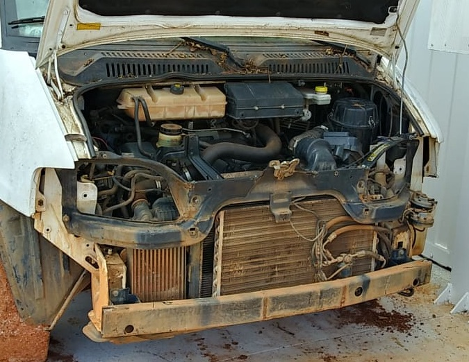

# Adaptação do veículo

Os detalhes da retirada do motor a combustão e demais componenetes tradicionais do veículo são registrados neste repositório. Tem pastas específicas para registro fotográfico dessa adaptação.

Ficha técnica da VAN

| item | Desicrição  | Valor  |  Unidade |
|:----:|:------------|:------:|:-----:|
| 1    | Comprimento  |       | m     |
| 2    | Altura       |       | m     | 
| 3    | Largura      |       | m     |
| 4    | Peso         |       | kg    |
| 5    | potência motor |     | CV/kW |
|
|
|
|





Na foto abaixo os diversos subsistemas são marcados: (destacar na foto do subsistemas)

1. arcondicionado
2. servo freio
3. motor diesel
4. direção hidraulica

Fazer uma descrição dos subsistemas com seus diversos componentes que serão retirados

## Subsistema arcondicionado

| item | Componentes | descrição e localização   |
|:----:|:------------|:-------------------------:|
| 1    | compressor  |       | 
| 2    | condensador |       | 
| 3    | mangeiras   |       | 
| 4    |  condensador

## Subsistema motor

| item | Componentes | descrição e localização   |
|:----:|:------------|:-------------------------:|
| 1    | compressor  |       | 
| 2    | condensador |       | 
| 3    | mangeiras   |       | 
| 4 | filtro do ar
| 5 | reservatório água

## Subsistema de freio

| item | Componentes | descrição e localização   |
|:----:|:------------|:-------------------------:|
| 1    | bomba  |       | 
| 2    | reservatório do óleo |       | 
| 3    | mangeiras   |       | |
| 4  | reservatório óleo de freio








