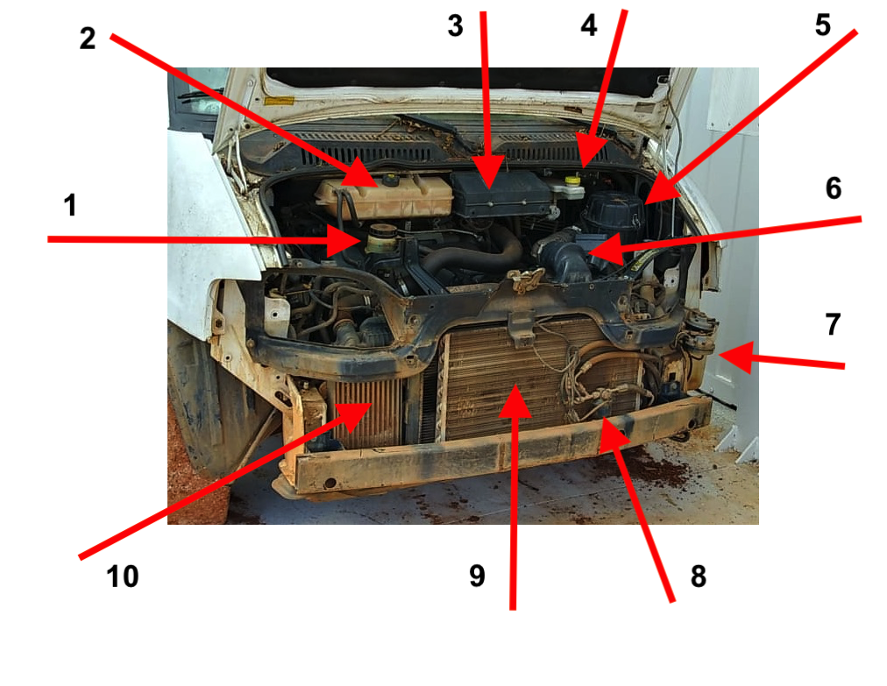
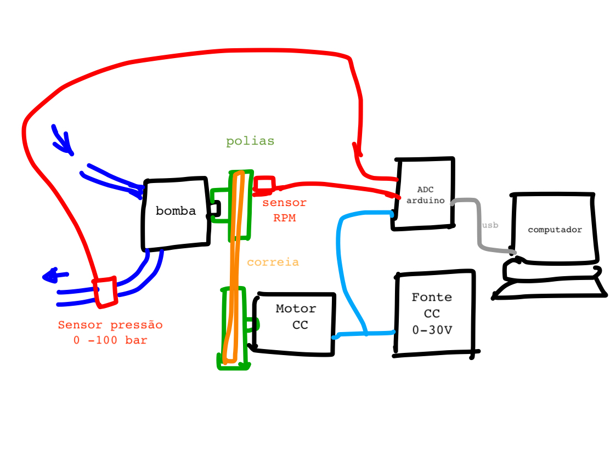

# Adaptação do veículo

Os detalhes da retirada do motor a combustão e demais componenetes tradicionais do veículo são registrados neste repositório. Tem pastas específicas para registro fotográfico dessa adaptação.

Ficha técnica da VAN

| item |  Desicrição  |    Valor   |Unidade|
|:----:|:-------------|:----------:|:-----:|
| 1    | Comprimento  |    5,599   |   m   |
| 2    | Altura       |    2,450   |   m   | 
| 3    | Largura      |    1,998   |   m   |
| 4    | Peso         |    1,980   |   kg  |
| 5    | Carga        |    1,520   |   kg  |
| 6    | potência motor |  127     |   CV  |

Subsistema do veículo

1. arcondicionado
2. servo freio
3. motor diesel
4. direção hidraulica

Na foto abaixo os diversos componentes são marcados: 

1. Reservatório da direção hidráulica
2. Reservatório do fluido de arrefecimento
3. Protetor da mangueira de ar quente
4. Reservatório do fluido de freio
5. Caixa do filtro de ar
6. Duto de admissão
7. Filtro de óleo diesel
8. Filtro secador do ar condicinado
9. Evaporador do ar condiciinoado
10. Radiador de óleo

# 1. Sistemas retirados

Fazer uma descrição dos subsistemas com seus diversos componentes que serão retirados

## 1.1. Subsistema motor

| item | Componentes | descrição e localização   | peso |
|:----:|:------------|:-------------------------:|-----:|
| 1    | Motor       |            | 
| 2    | motor de partida |       | 
| 3    | mangeiras   |            | 
| 4    | filtro do ar
| 5    | reservatório água
| 6    | Radiador
| 7    | Escapamento

## 1.2. Subsistema arcondicionado

| item | Componentes | descrição e localização   | peso |
|:----:|:------------|:-------------------------:|------|
| 1    | compressor  |       | 
| 2    | condensador |       | 
| 3    | mangeiras   |       | 

# 2. Sistemas modificados

Descrição dos subsistemas que serão modificados, apontando o que será mudado ou trocado. 

## 2.1. Subsistema de cambio e embreagem

| item | Componentes | descrição e localização   | peso |
|:----:|:------------|:-------------------------:|-----:|
| 1    | Volante     | Reduzir de tamanho e peso |      |
| 2    |             |        | 
| 3    |             |        |       
| 4    | 

## 2.2. Subsistema de freio

| item | Componentes | descrição e localização   | peso |
|:----:|:------------|:-------------------------:|-----:|
| 1    | bomba       |        |       |
| 2    | hidrovácuo  |       | 
| 3    | mangeiras   |        |       |
| 4    | reservatório óleo de freio

### 2.2.1 Bancada de ensaio de freio 
Para testar sistema hidraulico do freio será montada uma bancada de  ensaios com a bomba conforme a figura a seguir.

## 2.3. Subsistema de direção hidraulica

| item | Componentes | descrição e localização   | peso |
|:----:|:------------|:-------------------------:|-----:|
| 1    | bomba       |        |       |
| 2    |             |       | 
| 3    | mangeiras   |        |       |
| 4    | reservatório óleo de freio

Na bomba hidraulica tem uma notação da pressão nominal que é de 100 bar.

