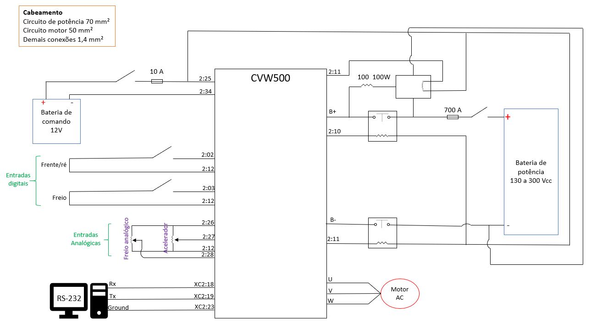

# Adaptação da VAN

link para arquivo original `Documentos/GitHub/Adaptacao-veiculo`

[github.com/Tecnomobele-FGA/Adaptacao-veiculo](https://github.com/Tecnomobele-FGA/Adaptacao-veiculo)

# 1. Introdução 

Este artigo mostra os detalhes adaptação da VAN, iniciando coom o registro da retirada do motor a combustão e demais componenetes tradicionais do veículo. 

Ficha técnica da VAN

| item |  Desicrição  |    Valor   |Unidade|
|:----:|:-------------|:----------:|:-----:|
| 1    | Comprimento  |    5,599   |   m   |
| 2    | Altura       |    2,450   |   m   | 
| 3    | Largura      |    1,998   |   m   |
| 4    | Peso         |    1,980   |   kg  |
| 5    | Carga        |    1,520   |   kg  |
| 6    | potência motor |  127     |   CV  |

Os diversos subsistema do veículo que vamos modificar ou adaptar são:

1. motor diesel
2. servo freio
3. direção hidraulica
4. arcondicionado

Figura 0.1. VAN Original

Figura 0.2. VAN Original com capo aberto 

Na foto abaixo os diversos componentes são marcados: 

Figura 0.3. VAN Original com os componentes no capo. 

Lista dos componentes:

1. Reservatório da direção hidráulica
2. Reservatório do fluido de arrefecimento
3. Protetor da mangueira de ar quente
4. Reservatório do fluido de freio
5. Caixa do filtro de ar
6. Duto de admissão
7. Filtro de óleo diesel
8. Filtro secador do ar condicinado
9. Evaporador do ar condiciinoado
10. Radiador de óleo

Os subsistemas com seus diversos componentes que foram retirados são:

## 1.1. Retirado do motor Diesel

| item | Componentes | descrição e localização   | peso |
|:----:|:------------|:-------------------------:|-----:|
| 1    | Motor       |            | 
| 2    | motor de partida |       | 
| 3    | mangeiras   |            | 
| 4    | filtro do ar
| 5    | reservatório água
| 6    | Radiador
| 7    | Escapamento

Figura 1.1.1. VAN sem radiador

Figura 1.1.2. Motor retirado 1

Figura 1.1.3. Motor retirado 2

Figura 1.1.4. VAN sem motor 

## 1.2. Subsistema arcondicionado

| item | Componentes | descrição e localização   | peso |
|:----:|:------------|:-------------------------:|------|
| 1    | compressor  |       | 
| 2    | condensador |       | 
| 3    | mangeiras   |       | 

Figura 1.2.1. Compressor do ar-condicionado

# 2. Instalação do motor elétrico 

O motor elétrico usado na conversão é um motor trifásico de indução fabricado pela WEG. A ficha técnica do motor é dado na tabela abaixo.

A imagem abixa mostra os detalhes do motor e em seguido é mostra o desenho técnico do motor com as dimensões e demais detalhes importante para sua utilização.

Figura 2. Motor Elétrico

## 2.1. Acoplamento 

Na instalação do motor elétrico optou-se em modificar a caixa de cambio 

Descrição dos subsistemas que serão modificados, apontando o que será mudado ou trocado. 

## 2.2. Subsistema de cambio e embreagem

| item | Componentes | descrição e localização   | peso |
|:----:|:------------|:-------------------------:|-----:|
| 1    | Volante     | Reduzir de tamanho e peso |      |
| 2    |             |        | 
| 3    |             |        |       
| 4    | 

Figura 2.1. Parte superior do cambio 

To join the motor to the gearbox, an intermediate plate was developed, fixing the gearbox housing to the electric motor housing. The gearbox was fixed to the diesel engine by very robust screws, but the electric motor is fixed by 4 M8 screws close to the axle, in addition to having two areas for fixing the side screws . Figure 2.2 shows the electric motor coupled to the gearbox.

Figure 2.2. Electric motor coupled to gearbox

The original engine and gearbox are supported by three attachments: two upper pads, one attached to the engine and the other to the gearbox, and, to prevent rotation of the assembly, a third lower pad attached to the gearbox. As the exchange will be maintained, its upper and lower cushions have been used and kept unchanged. To support the engine exchange assembly on the side of the electric motor, a support was developed that attaches to the upper and eyebolts of its frame and rests directly on the attachment of the upper cushion in the engine compartment, discharging the bending efforts generated by the oscillation of the vehicle due to floor undulations. The motor support is made of 2 mm thick flat sheet. The original rubber pad can be suppressed due to the low vibration of the electric motor.

Figure 2.3. a) Electric motor support b) coupling plate electric motor/gearbox

A coupling for the electric motor and gearbox housing was developed. It consists of a fixing plate that uses the gearbox housing fixing screws to the original motor and allows the electric motor to be fixed by its 4 screws close to the shaft. 

The gear shift differential is placed far to the left of the body, causing a difference in length between the two axles that connect to the wheels. The left axle has a tulip-type articulation next to the differential and the axle that will make the connection of power to the wheel by means of a homokinetic articulation.

The right axis, on the other hand, has an extension to the tulip-type joint, which is in the same mirrored position asthe one on the left side. From them, the semi-shafts that connect to the wheels by means of homokinetic joints are originated.

As the right axle shaft is long, at the same distance from the gearbox to the center of the vehicle there is a flanged sleeve, previously fixed directly to the diesel engine block in the upper position of the axle shaft, which keeps it aligned transversely. 

A bracket, fixed to the front suspension unit, was developed to secure the flanged sleeve. In order not to interfere with the electric motor, the position inferior to the semi-shaft was adopted. The vehicle's original transmission system was used without the clutch assembly, where the first and fifth and reverse gears were removed along with their respective drive and synchronized forks, in order to reduce the weight and inertia of the assembly. Reverse gear will be activated via inversion of the electric motor. Figure 2.5 shows the modification of the transmission.

Figure 2.5. Preventive Maintenance and Transmission Modification

In order to dimension the mechanical resistance of the coupling, fixing and attachment elements, a simulation was performed with Ansys program and as a result, a flange to fix the electric motor to the transmission, a sleeve of rigid coupling to connect the motor to the transmission, and a support for fixing the motor were designed.

The mechanical simulations performed are intended to certify that the designed coupling is capable of withstanding the mechanical loads to which it will be subjected. The assembly diagram of the coupling is shown in Figure 3b, while Figure (2.6-a) shows the flange and shaft coupling together The 3D model was imported from CATIA V5R20 software into ANSYS 2018 and its mesh was created. 

The configuration was performed with respect to the keyed part as well as the fit of the flange to the coupling Figure (2.6-b). It should be noted that for the mesh to be acceptable, the Element Quality should be as close to 1 as possible, 0.05 being the limit for an acceptable mesh. In addition to this factor, the Skewness was used, the closer to 0 the better, being distortions greater than 0.95 unacceptable (LEE, 2020).

Figure 2.6. (a) Motor support flange and the shaft coupling. (b) Mesh element quality of the coupling meeting Element Quality and Skewness criteria.

The shaft coupling material is SAE 1045 steel. The simulation result for the von-Mises stress has a maximum of 22.503 MPa. Thus, it is possible to see that the yield stress of SAE 1045 steel is 310 MPa and analyzing the maximum found in the simulation, there is a margin of 287.5 MPa for the material to deform plastically, i.e., permanently. Knowing also that the stress for rupture of the material is 565 MPa, it is safe to say that the torque exerted will not cause rupture of the material.

The equivalent stress result for the von-Mises criterion was obtained and with the yield stress value of the material, the safety factor (SS) can be calculated for the simulated part, equation (1)

F S = σ limite / σ vonMises   = 310 MPa / 22,5 MPa =13,77    (1) 

Another analysis for the project is to determine how much this part would deform if it were subjected to the situation when it has the peak torque of the motor. Thus, the directional deformation of the part was simulated, focusing on the same axis to which the torque was applied. The maximum deformation occurs in the keyed region and has a dimension of (6.1×10-8) meters, a very low deformation.

# 3. Freio eletro-hidro-vácuo

Diesel vehicles, with few exceptions, do not have air flow control butterfly, being equipped with mechanical vacuum pumps to activate the brake servo. This mechanical vacuum pump is driven by the internal combustion engine. With the installation of the electric motor, the mechanical driven vacuum pump must be replaced by an automotive electric vacuum pump, present in some models of internal combustion engine vehicles. 

The original hydro-vacuum brake servo system was replaced by an electric-hydro-vacuum brake servo system connected to the original hydraulic brake. The electric vacuum pump will be responsible for generating the vacuum pressure present in the brake booster compartment, and this must be sufficient to ensure that the pedal actuating force multiplication required to safely brake the vehicle is achieved. A control system will be implemented in order to ensure that the vacuum present in the brake booster compartment is always within the optimum operating values. An optimal value will be defined for the vacuum pressure in the brake booster compartment. 

A sensor will monitor the actual vacuum pressure in the compartment and send a signal to the controller. The actual value obtained from the sensor and the predefined optimum value will be compared in order to check if the system is operating as desired. The controller, through this comparison, sends a command to increase or decrease the power supply to the electric vacuum pump in order to ensure that the pressure present in the brake booster compartment approaches the ideal value. A closed loop control system with feedback will then be implemented. Also in the project to implement the control system, techniques will be implemented to ensure the stability of the system. A schematic of the test bench for the new brake servo system to be implemented in the vehicle can be observed in Fig. 3.1.

Figure 3.1. Bench test setup diagram

## 3.1 Bancada de ensaio de freio 
Para testar sistema hidraulico do freio será montada uma bancada de  ensaios com a bomba para caracterizar o sistema e projetar o seu sistema de controle.

# 4. Substituição do sistema de direção hidraulica por elétrico

Componentes do sistema hidro-vácuo 

Figura 4.1. Bomba hidraulico retirada

| item | Componentes | descrição e localização   | peso |
|:----:|:------------|:-------------------------:|-----:|
| 1    | bomba       |        |       |
| 2    | hidrovácuo  |       | 
| 3    | mangeiras   |        |       |
| 4    | reservatório óleo de freio

This vehicle originally had a hydraulic power steering system, which uses a pump to pressurize the hydraulic oil, and assist the drivers to steer the vehicle, reducing the needed effort. 
The pump was driven by the internal combustion engine. To keep a power steering assistant, there were two alternative s: (i) an electro-hydraulic system or (ii) an electric system. For the first option it would be necessary to manufacture the supports to uphold the system and add an electric motor to pressurize the pump. For the second alternative it would be only necessary to adapt the electric system to the steering system. 

The electric system is small and easy to install. It uses an electric motor and all the components are grouped together. The ZF TRW manufacturer affirms the electro hydraulic system is more efficient than the hydraulic one. The electro hydraulic system, in comparison with the conventional hydraulic system, uses only 25% of the energy to operate and it generates a fuel economy up to 0.3l/100km and it reduces the carbon dioxide’s emission up to 7g/km. The better performances are explained because the hydraulic system is always connected to the engine, it consumes energy from the engine all the time, while the electro-hydraulic system and the electric system just use energy on demand. (TRW, 2020) 

The power steering pump, the oil tank and the hoses were removed. An electric steering system originally from a Volkswagen Up was adapted and installed. The original rack and pinion steering system were maintained. The oil outlets/inlets of the valve and the hydraulic cylinder were isolated. The choice of the electric column was made from the models available at the university when the conversion was made.

# 5. Sistema de Arrefecimento
 
Design of a new water cooling subsystem for the electric motor. The cooling subsystem with the replacement of the original pump by an electric pump was preceded by the thermodynamic calculation of the performance of the coolant flow. The electric motor cooling subsystem was designed using the original radiator with an appropriate flow driven by an electric water pump for circulation. 

For cost reduction, the original radiator already present in the vehicle was used, as it was in good condition and maintains the vehicle's original fixings, despite being oversized for the new engine. Table 2 shows an estimate of the amounts of heat that should be removed from the engine and electronics controller by the cooling system.

* Eficiencia térmica

| Motor  | Potência | Eficiencia | Perda de calor |
|:------:|:--------:|:----------:|:--------------:|
| Diesel Peugot | 93,4 kW | 30% | 65,4 kW/h |
| Elétrico WEG VE-M01 |60 kW | 95% | 3 kW/h | 

The original cooling system was designed to attend a heat loss of 65 kW/h while the new system barely needs to lose 3kW/h. So the new cooling system will use less than 5% of the capacity of the original cooling structure.

* Geração de calor 

| Equipamento  | Caracteristicas |
|:------------:|:---------------:|
| Motor VE-M01 | 60 kW |
| Maximum flow | 18 L/min |
| Minimum flow | 2.0 bar |
| Inverter CVW 500 | 1.75 - 3.6 kW |
| Minimum flow | 8 L/min |
| Maximum flow | 20 L/min |
| Working pressure | 0.5 - 2.0 bar |
| Maximum pressure | 2.5 bar |

The proposed cooling system is composed of an expansion reservoir where the coolant is stored, an electric pump for liquid circulation, a radiator to perform the heat exchange, and a set of hoses and connections responsible for interconnecting this system. 

The idea behind this assembly is to keep it as close as possible to the original ICE cooling system. The only main difference is the amount of heat produced by the electric powertrain and the liquid circulation pump. The liquid in the reservoir is pumped through a single outlet of the pump and routed separately, via a line splitter, to the electric motor and to the inverter motor drive where it removes heat from the components. Then the cooling lines meet again and proceed through a single line to the radiator, where the liquid loses, through conduction, the heat previously acquired. The schematic in Fig 8 shows the coolant flow within the system as well as the heat behavior in this application.

 
 
Figure 8: Cooling system heat schematic 
 
# 6. Instalação do Inversor

Figura 6.1. Foto Inversor CVW500

 

Figura 6.2. Diagrama de blocos inversor 

Figura 6.3. Diagrama de blocos instalação inversor 
 
 
# 6.1. Hub de conexões

Para a instalação do Inversor é necessária criar alguns suportes para instalação dos componentes eletricos e eletrônicos. 
O primeiro suporte que chamaremos de *HUB de conexões* terá a função de facilitar a instalação de toda a fiação de controle e comando vindos do inversor e disponibilizar seu acesso na hora da montagem ou manutenção. A figura 6.1.1 mostra o esquematico deste hub.

Figura 6.1.1. Esquem Hub de conexão

A implementação do hub em placa de circuito impresso é mostrada na figura 6.1.2

Figura 6.1.3. Placa de circuito impresso do Hub de conexões

Figura 6.1.4. Foto Hub de conexão

O segundo suporte é para alojar os contactores de potência e o resistor de pre-carga / descarga do inversor. O esquema é mostrada na figura 6.1.3.

Figura 6.1.3. Esquema da ligação dos contactores e resistor de pre-carga
 
# 7. Bibliografia

* Khalil, Saleh, João Wohlgemuth, Danilo dos Santos Oliveira, Gabriel Henrique Chules, João Gabriel Paulino de Souza, Pedro Augusto Andrade Rodrigues, Maria Eduarda Borges Galvão, and Rudi Henri van Els. 2021. “Tecnombelet – Adaption of VAN for Electric Propulsion and Design of Steering, Cooling and Braking Assistance Subsystems.” in Cobem 26 International Congress of Mechanical Engineering. 

* Lopes, Luyza Lorenna Lacerda. 2021. “Estudo Da Conversão Do Trem de Potência a Combustão Para Elétrico de Uma Van - Análise Da Demanda de Potência e Projeto Da Bancada de Ensaios.” Universidade de Brasília UnB - Faculdade Gama (Trabalho de conclusão de curso - Engenharia de Energia).

* Silva, Paulo Cezar da. 2021. “Análise de Viablidade Técnica e Econômica Da Conversão de Van Peugeot a Combustão Para Elétrica.” Universidade de Brasília - campus Gama (Trabalho de Conclusão de Curso 1 de Engenharia Automotiva).

* Silva, Paulo Cezar da and Rudi Henri van Els. 2021. “Methodology for Optimizing Battery Size When Converting Internal Combustion Utilities Vehicle to Electric Traction.” in Cobem 26 International Congress of Mechanical Engineering. Cobem 2021.